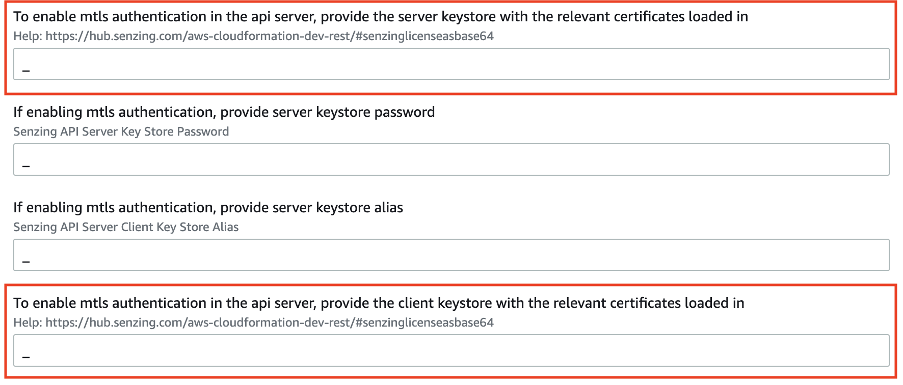

# aws-cloudformation-dev-rest

## Synopsis

Using the AWS Cloudformation template in this repository,
a developer can bring up an AWS stack to interact with Senzing's API server
in a secure manner.

## Overview

The following diagram illustrates a Senzing stack that would be brought up by the AWS CloudFormation template.

Using this stack, a developer could view the api documentation via swagger and access Senzing's api server to interact with Senzing.


## Contents

1. [Pre-requisites](#pre-requisites)
1. [How to Deploy](#how-to-deploy)
1. [How to generate keystores for SSL client authentication](#how-to-generate-keystores-for-ssl-client-authentication)
1. [How to interact using SSL client authentication](#how-to-interact-using-ssl-client-authentication)
1. [Example application](#example-application)
1. [References](#references)

## Pre-requisites

1. Deploy [aws-cloudformation-database-cluster cloudformation stack](https://github.com/Senzing/aws-cloudformation-database-cluster)
1. FIXME: Install `keytool`
    1. FIXME: Make it clear what needs to be installed and why a certain version is needed.
    1. FIXME: Install [adoptopenjdk 11](https://adoptopenjdk.net/archive.html)
    1. FIXME:  If the `keytool` is already installed...
1. Install [git](https://github.com/Senzing/knowledge-base/blob/master/HOWTO/install-git.md)

## How to Deploy

1. :warning: **Warning:** This Cloudformation deployment will accrue AWS costs.
   With appropriate permissions, the
   [AWS Cost Explorer](https://aws.amazon.com/aws-cost-management/aws-cost-explorer/)
   can help evaluate costs.
1. Visit [AWS Cloudformation with dev-rest template](https://console.aws.amazon.com/cloudformation/home#/stacks/new?stackName=sz-dev&templateURL=https://s3.amazonaws.com/public-read-access/aws-cloudformation-dev-rest/cloudformation.yaml)
1. At lower-right, click on "Next" button.
1. In **Specify stack details**
    1. In **Parameters**
        1. In **Senzing installation**
            1. Accept the End User License Agreement
            1. Adjust the Senzing version, if necessary
            1. If using more than 100k records, input base64 encoded license string
        1. In **Identify existing database stack**
            1. Enter the stack name of the previously deployed
               [aws-cloudformation-database-cluster](https://github.com/Senzing/aws-cloudformation-database-cluster)
               Cloudformation stack
               Example:  `senzing-db`
        1. In **Security**

           :warning: the following assumes a "Server store file" and "Client trust store file"
           have been created.
           If not, see
           [How to generate keystores for SSL client authentication](#how-to-generate-keystores-for-ssl-client authentication).

           [How to generate keystores for SSL client authentication](#how-to-generate-keystores-for-ssl-client-authentication)

            1. Enter your email address.
                1. Example: `me@example.com`
            1. Enter the permitted IP address block
            1. Enter a base64 representation of the *server* keystore
                1. Example: Contents of `KEYTOOL_SERVER_STORE_FILE_BASE64` file created below.
            1. Enter the server keystore password
                1. Example: Value of `KEYTOOL_SERVER_PASSWORD` created below.
            1. Enter the server keystore alias
                1. Example: Value of `KEYTOOL_SERVER_ALIAS` created below.
            1. Enter a base64 representation of the *client* keystore
                1. Example: Contents of `KEYTOOL_CLIENT_TRUST_STORE_FILE_BASE64` file created below.
            1. Enter the client keystore password
                1. Example: Value of `KEYTOOL_CLIENT_PASSWORD` created below.
        1. In **Security responsibility**
            1. Understand the nature of the security in the deployment.
            1. Once understood, enter "I AGREE".
    1. At lower-right, click "Next" button.
1. In **Configure stack options**
    1. At lower-right, click "Next" button.
1. In **Review senzing-basic**
    1. Near the bottom, in **Capabilities**
        1. Check ":ballot_box_with_check: I acknowledge that AWS CloudFormation might create IAM resources."
    1. At lower-right, click "Create stack" button.

## How to generate keystores for SSL client authentication

The following example instructions would typically be done by a **system admin**
before bringing up this cloudformation template.

1. :pencil2: Create values for variables.
   Example:

    ```console
    export KEYTOOL_CLIENT_ALIAS=my-senzing-client
    export KEYTOOL_CLIENT_CERTIFICATE_FILE=~/my-senzing-client.cer
    export KEYTOOL_CLIENT_PASSWORD=BadClientPassword
    export KEYTOOL_CLIENT_STORE_FILE=~/my-senzing-client-store.p12
    export KEYTOOL_CLIENT_TRUST_STORE_FILE=~/my-senzing-client-trust-store.p12
    export KEYTOOL_SERVER_ALIAS=my-senzing-server
    export KEYTOOL_SERVER_PASSWORD=BadServerPassword
    export KEYTOOL_SERVER_STORE_FILE=~/my-senzing-server-store.p12
    ```

1. Synthesize variables.
   Example:

    ```console
    export KEYTOOL_CLIENT_TRUST_STORE_FILE_BASE64=${KEYTOOL_CLIENT_TRUST_STORE_FILE}.base64
    export KEYTOOL_SERVER_STORE_FILE_BASE64=${KEYTOOL_SERVER_STORE_FILE}.base64
    ```

1. Create the *server* PKCS12 key store (`KEYTOOL_SERVER_STORE_FILE`).

   **NOTE:** Answer prompts for the 7 fields for the Distinguished Name ("DN") for the certificate being generated.
   Example:

    ```console
    keytool \
        -alias ${KEYTOOL_SERVER_ALIAS} \
        -genkey \
        -keyalg RSA \
        -keysize 2048 \
        -keystore ${KEYTOOL_SERVER_STORE_FILE} \
        -storepass ${KEYTOOL_SERVER_PASSWORD} \
        -storetype PKCS12 \
        -validity 730
    ```

1. Create the *client* PKCS12 key store (`KEYTOOL_CLIENT_STORE_FILE`).
   A single authorized client certificate is assumed for example purposes.
   Create the client key and certificate for the client to use.

   **NOTE:** Answer prompts for the 7 fields for the Distinguished Name ("DN") for the certificate being generated.
   Example:

    ```console
    keytool \
        -alias ${KEYTOOL_CLIENT_ALIAS} \
        -genkey \
        -keyalg RSA \
        -keysize 2048 \
        -keystore ${KEYTOOL_CLIENT_STORE_FILE} \
        -storepass ${KEYTOOL_CLIENT_PASSWORD} \
        -storetype PKCS12 \
        -validity 730
    ```

1. Export the client certificate (`KEYTOOL_CLIENT_CERTIFICATE_FILE`).
   Example:

    ```console
    keytool \
        -alias ${KEYTOOL_CLIENT_ALIAS} \
        -export \
        -file ${KEYTOOL_CLIENT_CERTIFICATE_FILE} \
        -keystore ${KEYTOOL_CLIENT_STORE_FILE} \
        -storepass ${KEYTOOL_CLIENT_PASSWORD} \
        -storetype PKCS12
    ```

1. Create a trust store containing certificate (`KEYTOOL_CLIENT_TRUST_STORE_FILE`).
   Example:

    ```console
    keytool \
        -alias ${KEYTOOL_CLIENT_ALIAS} \
        -file ${KEYTOOL_CLIENT_CERTIFICATE_FILE} \
        -import \
        -keystore ${KEYTOOL_CLIENT_TRUST_STORE_FILE} \
        -storepass ${KEYTOOL_CLIENT_PASSWORD} \
        -storetype PKCS12
    ```

1. Convert server store and client store `.p12` files base64 strings.
   Example:

    ```console
    base64 \
      ${KEYTOOL_CLIENT_TRUST_STORE_FILE} \
      >> ${KEYTOOL_CLIENT_TRUST_STORE_FILE_BASE64}

    base64 \
      ${KEYTOOL_SERVER_STORE_FILE} \
      >> ${KEYTOOL_SERVER_STORE_FILE_BASE64}
    ```

1. Insert base64 string into the cloudformation stack.



## How to interact using SSL client authentication?

1. Clone repository
   First, set these environment variable values:

    ```console
    export GIT_ACCOUNT=senzing
    export GIT_REPOSITORY=aws-cloudformation-dev-rest
    export GIT_ACCOUNT_DIR=~/${GIT_ACCOUNT}.git
    export GIT_REPOSITORY_DIR="${GIT_ACCOUNT_DIR}/${GIT_REPOSITORY}"
    ```

   then using the environment variables values just set,
   follow steps in [clone-repository](https://github.com/Senzing/knowledge-base/blob/master/HOWTO/clone-repository.md)
   to install the Git repository.

1. :pencil2: Retrieve the senzing api server url from the cloudformation stack that was brought up.
   It can be found in the output tab, under the key "UrlApiServer".
   **Note:** No trailing slash.
   Example:

    ```console
    export SENZING_API_SERVER_URL=https://XXXXXXXX.amazonaws.com/api
    ```

   This is what it looks like in the AWS Cloudformation management console:

   

1. To interact directly with the Senzing API server,
   use the `--cert` and `--cert-type` options of
   `curl` to authenticate to the API server.
   Example:

    ```console
    curl \
        --insecure \
        ${SENZING_API_SERVER_URL}/heartbeat \
        --cert ${KEYTOOL_CLIENT_STORE_FILE}:${KEYTOOL_CLIENT_PASSWORD} \
        --cert-type P12
    ```

## Example application

An example python application that authenticates with the senzing's api server
is seen at [demo.py](examples/demo.py).

To run the example python application:

1. Export the following variables.
   Example:

    ```console
    export CLIENT_STORE_PATH=${KEYTOOL_CLIENT_STORE_FILE}
    export CLIENT_STORE_PASSWORD=${KEYTOOL_CLIENT_PASSWORD}
    export API_HEARTBEAT_URL=${SENZING_API_SERVER_URL}
    ```

1. Use the following commands to run the example application.
   Example:

    ```console
    cd ${GIT_REPOSITORY_DIR}/examples
    pip install -r requirements.txt
    export FLASK_APP=demo
    flask run
    ```

1. To get the sample python application to interact the Senzing's api server, simply send the following curl command.
   Example:

    ```console
    curl http://127.0.0.1:5000

    curl http://127.0.0.1:5000/test-query
    ```

   Or in a browser visit:

   - [http://127.0.0.1:5000](http://127.0.0.1:5000)
   - [http://127.0.0.1:5000/test-query](http://127.0.0.1:5000/test-query)

## References

To understand mutual TLS authentication better, refer to the resources here:

- [What is Mutual TLS Authentication?](https://www.cloudflare.com/learning/access-management/what-is-mutual-tls/)
- [Difference between key store and trust store](https://www.baeldung.com/java-keystore-truststore-difference)
