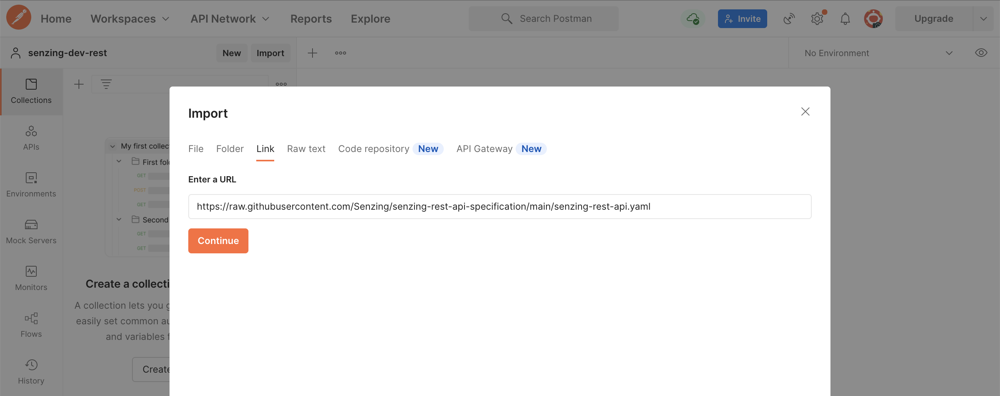
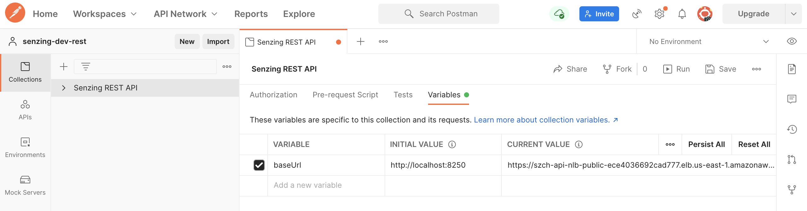
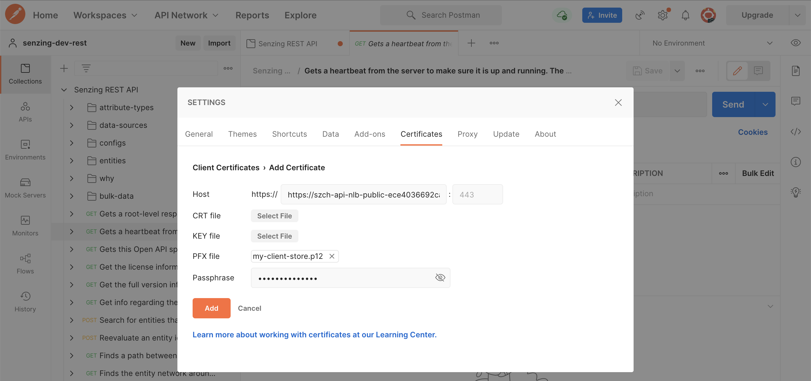
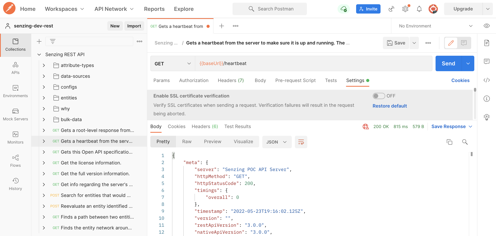

# Interact with Senzing API Server using Postman

1. Create a workspace.
    1. Postman > Workspaces > Create Workspace
    1. In "Create Workspace":
        1. **Name:** Senzing Rest API
1. Import Senzing's REST API specification into Postman:
    1. Select "Senzing API" workspace
        1. Postman > Workspaces > Senzing Rest API
    1. Click the "Import" button.
    1. Select the "Link" tab.
    1. In "Enter a URL", enter `https://raw.githubusercontent.com/Senzing/senzing-rest-api-specification/main/senzing-rest-api.yaml`.

        

    1. Click "Continue" button.
    1. In "Import" dialog:
        1. Click "Import" button.
        1. In "Import complete", click "Close" button.
1. Update **baseUrl** value.
    1. In left-hand navigation bar, select "Collections".
    1. Select "Senzing REST API"
    1. Select "Variables" tab.
    1. For the variable "baseUrl", modify the "CURRENT VALUE"
       to be the value of the **UrlApiServer** seen in the
       "Outputs" tab of the AWS Senzing Dev-Rest Cloudformation.

        

    1. In the upper-right, click the "Save" icon.

1. Import the client certificate.
    1. In the top tool bar, click on the "Settings" (gear) icon.
    1. In the drop-down menu, choose "Settings".
    1. In the "Settings" dialog box, choose the "Certificates" tab.
    1. Click the "Add Certificate" link.
    1. In "Settings" dialog box:
        1. **Host:** The hostname of ${SENZING_API_SERVER_URL}.
           *Note:* Do not include `https://` nor `/api`.
           Example:

            ```console
            echo ${SENZING_API_SERVER_URL} | sed -e "s|^https://||" -e "s|/api$||"
            ```

        1. **PFX file:** The file specified in ${CLIENT_STORE_P12_FILE}.
           Example:

            ```console
            echo ${CLIENT_STORE_P12_FILE}
            ```

        1. **Passphrase:** The value of ${SECRET_CLIENT_KEYSTORE_PASSWORD_VALUE}.
           Example:

            ```console
            echo ${SECRET_CLIENT_KEYSTORE_PASSWORD_VALUE}
            ```

        

        1. Click "Add" button.
        1. Close "Settings" dialog box.
1. Disable SSL certificate verification.
    1. In the top tool bar, click on the "Settings" (gear) icon.
    1. In the drop-down menu, choose "Settings".
    1. In the "Settings" dialog box, choose the "General" tab.
    1. Turn "SSL certificate verification" off.
1. Send a request.
    1. In left-hand navigation, select "Senzing REST API" collection.
    1. Click on the request that starts with "Gets a heartbeat from the serv...".
    1. In the upper-right, click on the "Send" button.

    
